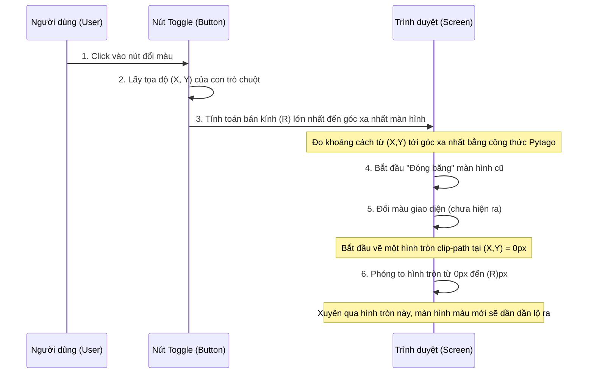

# Logic Hiệu Ứng Chuyển Đổi Giao Diện Sáng/Tối (View Transitions API)

Hiệu ứng chuyển đổi giao diện (Dark/Light mode) với một vòng tròn mở rộng dần từ vị trí con trỏ chuột được thực hiện dựa trên **View Transitions API** mới của trình duyệt. Dưới đây là giải thích chi tiết từng bước kết nối trực tiếp với sơ đồ tuần tự.

## Sơ Đồ Xử Lý (Sequence Diagram)

---

## Giải Thích Chi Tiết Từng Bước

### Bước 1: Người dùng thao tác (Click Event)
- **Hành động:** Người dùng nhấp chuột vào nút chuyển đổi (Toggle Button) giữa chế độ Sáng và Tối (Light/Dark mode).
- **Mục đích:** Lắng nghe và kích hoạt quá trình chuyển đổi giao diện.

### Bước 2: Lấy Tọa Độ (X, Y) Tâm Vòng Tròn
- **Hành động:** Trình duyệt nhận sự kiện click và trích xuất tọa độ `X` (chiều ngang - `clientX`) và `Y` (chiều dọc - `clientY`) của con trỏ chuột ngay tại khoảnh khắc nhấp.
- **Mục đích:** Điểm `(X, Y)` này sẽ đóng vai trò là **tâm của vòng tròn** chuyển đổi. Hiệu ứng gợn sóng/ánh sáng sẽ bắt đầu lan tỏa từ tâm điểm chính xác này, tạo cảm giác trực quan và liền mạch với ngón tay/con chuột của người dùng.

### Bước 3: Tính Toán Bán Kính Mở Rộng (Max Radius - R)
- **Hành động:** Thuật toán (thường được lập trình viên sử dụng định lý Pytago qua hàm `Math.hypot()`) sẽ đo khoảng cách hình học từ điểm tâm `(X, Y)` đến cả 4 góc của cửa sổ trình duyệt. Nó sẽ chọn lấy đường chéo dài nhất làm bán kính tối đa `R`.
- **Mục đích:** Giao diện có người thì dùng toàn màn hình, có người dùng nửa màn hình. Việc tính toán bán kính `R` nhằm đảm bảo rằng khi vòng tròn phóng to đến mức tối đa, nó sẽ chắc chắn **bao phủ hoàn toàn 100% diện tích màn hình**, không để chừa lại bất kì góc khuất méo mó nào chưa được phủ màu.

### Bước 4: Chụp Ảnh và "Đóng Băng" (View Transitions API)
- **Hành động:** Lệnh `document.startViewTransition()` bắt đầu được gọi. Trình duyệt ngay lập tức làm hai phản xạ không điều kiện:
  1. Chụp lại một bức ảnh (Screenshot chất lượng cao) của giao diện CŨ hiện tại.
  2. "Đóng băng" DOM (nội dung trang web đối với mắt người dùng sẽ tạm thời chỉ là bức ảnh tĩnh này, không thể tương tác vài mili-giây).

### Bước 5: Cập Nhật Trạng Thái Giao Diện (DOM Update)
- **Hành động:** Trong khi màn hình đang đóng băng, Javascript xử lý ngầm việc thay đổi class CSS gốc (thường là gài thêm class `.dark` ở thẻ `<html>` hoặc `<body>`).
- **Mục đích:** Đổi toàn bộ màu sắc, hình nền, chữ viết... ngay tức khắc sang giao diện MỚI dọn sẵn. Phải chú ý rằng, người dùng lúc này **vẫn chưa thể nhìn thấy** giao diện mới do bức ảnh chụp màn hình cũ chụp từ Bước 4 vẫn đang nằm đè chèn lên trên giống như một tấm chăn.

### Bước 6: Phóng To Vòng Tròn (Clip-Path Animation)
- **Hành động:** Đây là phần "ảo thuật" mấu chốt của công nghệ View Transitions:
  - Trình duyệt tự động đưa giao diện MỚI đặt lên lớp trên cùng đè lên bức ảnh CŨ.
  - Lúc đầu, màn MỚI này bị CSS mask ẩn hoàn toàn, chỉ đục chừa lại một cái lỗ tròn cực kỳ nhỏ xíu (r=0px) ngay tại cái tâm `(X, Y)` nãy tính bằng thuộc tính `clip-path: circle(0px at X Y)`.
  - Trình duyệt kích hoạt chuyển động mượt (Animation): Mở rộng cái vòi lỗ tròn này từ kích thước hạt cát `0px` lên thành một vòng xuyến khổng lồ đi hết bán kính `(R)px`.
  
- **Kết quả hiển thị:** Nếu quan sát bằng mắt, thông qua chiếc lỗ tròn ngày càng phình lớn dần ra này, mặt giao diện màu MỚI bóng bẩy dần dần túa ra gặm nhấm diện tích màn hình, nuốt chửng hoàn toàn toàn mặt bức ảnh CŨ ở dưới cùng. Cuối cùng, khi vòng xuyến chạm mốc Max Radius, chiếc ảnh cũ chính thức bị tiêu hủy, nhường chỗ lại hoàn toàn cho giao diện Mới tỏa sáng — Mọi thứ diễn ra trong chưa đầy 0.5 giây!
